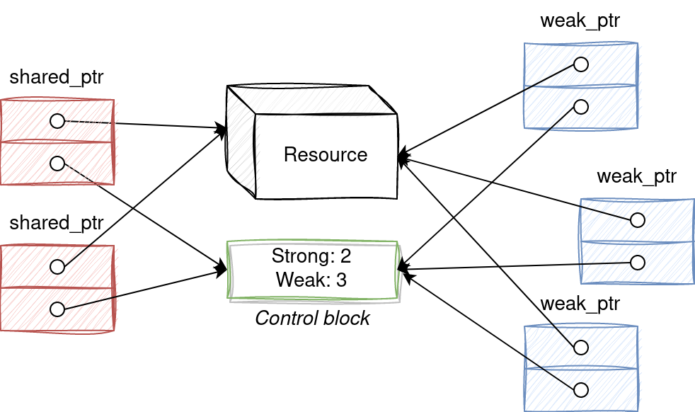

### Why `std::weak_ptr` is Needed

`std::weak_ptr` is needed to **safely observe** an object managed by `std::shared_ptr` **without affecting its lifetime**.

---

#### ✅ 1. Avoid Circular References (Memory Leaks)

If two objects hold `std::shared_ptr` to each other, they never get destroyed — a **reference cycle**.

```cpp
struct B;

struct A {
    std::shared_ptr<B> b_ptr;
};

struct B {
    std::shared_ptr<A> a_ptr; // ❌ strong cycle, both A and B will never be deleted
};
````

**Solution:**
Make one of them a `std::weak_ptr` to break the cycle:

```cpp
struct B {
    std::weak_ptr<A> a_ptr; // ✅ breaks the cycle
};
```

---

#### ✅ 2. Observe Without Ownership

You can use `std::weak_ptr` to check if an object still exists, and lock it into a `shared_ptr` if needed.

```cpp
std::shared_ptr<MyClass> sp = std::make_shared<MyClass>();
std::weak_ptr<MyClass> wp = sp;

if (auto locked = wp.lock()) {
    // Object is still alive
    locked->doSomething();
} else {
    // Object has already been deleted
}
```

---

### � Key Concepts

* `std::weak_ptr` does **not** increase the reference count.
* It keeps the **control block** alive, but **not** the managed object.
* To access the object, you must call `.lock()` and check if it succeeded.
* Used in **caches**, **observers**, **graphs**, and **parent-child relationships**.

---


# `std::shared_ptr` Circular Dependency Problem and `std::weak_ptr` Solution

Understanding `std::shared_ptr` is crucial for modern C++ memory management. While it greatly simplifies resource management by providing shared ownership and automatic cleanup, it's not without its pitfalls. One of the most common and challenging problems is the **circular dependency**, which leads to memory leaks. This document will explain the internal workings of `shared_ptr`, its control block, and how `std::weak_ptr` resolves the circular dependency issue.

---

## 1. `std::shared_ptr` Basics: Shared Ownership

`std::shared_ptr` is a smart pointer that allows multiple pointers to own the same object. It employs a reference-counting mechanism to determine when the managed object should be deallocated.

- **Copying a `shared_ptr`** increases the reference count.
- **Destroying or resetting a `shared_ptr`** decreases the reference count.
- When the **reference count becomes zero**, the object is automatically destroyed.

This model of shared ownership is powerful, but not robust against all ownership patterns—particularly **circular dependencies**.

---

## 2. Internal Implementation: The Control Block

To manage the reference count and related data, `std::shared_ptr` uses a control block, dynamically allocated on the heap.

Each `std::shared_ptr` contains:
- A pointer to the **managed object**.
- A pointer to the **control block**.

### What's Inside the Control Block?

- **Strong Reference Count (Use Count)**: Tracks how many `shared_ptr` instances own the object.
- **Weak Reference Count**: Tracks how many `weak_ptr` instances observe the object.
- **Deleter**: Handles custom object deletion.
- **Allocator**: Handles custom memory deallocation (if used).
- **Managed Object Pointer**: Raw pointer to the object (may be embedded when using `make_shared`).

The **object is destroyed** when the strong count drops to zero. The **control block is destroyed** when both strong and weak counts drop to zero.

---

## 3. Counter Increments and Decrements

### Strong Reference Count (shared_ptr)

**Increments** when:
- Copying or assigning a `shared_ptr`.
- Creating a `shared_ptr` from a raw pointer.
- Converting a `weak_ptr` to `shared_ptr` using `.lock()`.

**Decrements** when:
- A `shared_ptr` goes out of scope.
- It is explicitly reset or moved.

> The object is deleted when **strong count == 0**.

### Weak Reference Count (weak_ptr)

**Increments** when:
- A `weak_ptr` is created or assigned from a `shared_ptr` or another `weak_ptr`.

**Decrements** when:
- A `weak_ptr` goes out of scope or is reset.

> `weak_ptr` does **not affect** the strong reference count.

### Memory Deletion Sequence

<div style="color: red; font-size: 18px;">

1. <strong>Managed Object</strong> is deleted when strong count hits 0.  
2. <strong>Control Block</strong> is deleted when both strong and weak counts are 0.

<code>std::weak_ptr</code> refers to the control block to know if the object still exists and if so, to provide a <code>std::shared_ptr</code> to it when needed. For that reason, the control block must exist as long as either a <code>std::weak_ptr</code> or a <code>std::shared_ptr</code> exists. You need to track the number of instances of <code>std::weak_ptr</code> to know when the last one is destroyed, just like for <code>std::shared_ptr</code>.

</div>




---

## 4. The Circular Dependency Problem

Circular dependencies occur when objects hold `shared_ptr` references to each other.

### Example

```cpp
std::shared_ptr<A> ptrA = std::make_shared<A>();
std::shared_ptr<B> ptrB = std::make_shared<B>();

ptrA->set_b(ptrB);  // A holds shared_ptr to B
ptrB->set_a(ptrA);  // B holds shared_ptr to A
````

### Problem

* `ptrA` and `ptrB` go out of scope.
* But A holds B and B holds A using `shared_ptr`.
* Strong counts never drop to 0.
* **Destructors are never called**.
* **Memory leak** occurs (caught by AddressSanitizer).

---

## 5. `std::weak_ptr` as the Solution

`std::weak_ptr` breaks the cycle by offering a **non-owning reference**.

### Key Benefits

* Does **not** increase the strong count.
* Allows checking if the object is still alive.
* Can be converted to `shared_ptr` using `.lock()`.

### Applying to the Example

Let A own B via `shared_ptr`, and B refer back to A using `weak_ptr`:

```cpp
ptrA->set_b(ptrB);        // A owns B
ptrB->set_a_weak(ptrA);   // B refers to A weakly
```

### Result

* When `ptrA` goes out of scope, A's strong count drops to 0, A is deleted.
* A's `shared_ptr` to B is also destroyed → B’s count drops.
* When `ptrB` goes out of scope, B is also deleted.
* **No memory leaks.**

---

### Accessing the Managed Object from `std::weak_ptr`

```cpp
std::weak_ptr<MyClass> weakPtr;

if (auto shared = weakPtr.lock()) {
    shared->doSomething();  // Safe access
} else {
    std::cout << "Object no longer exists.\n";
}
```

`.lock()` returns a `shared_ptr` if the object is still alive, or an empty one if not.

---

## Conclusion

The `std::shared_ptr` circular dependency is a critical concept in C++. While it simplifies memory management, it cannot handle circular references alone. `std::weak_ptr` solves this problem by offering a non-owning way to reference shared objects, avoiding strong cycles and memory leaks.

> Mastering the proper use of `shared_ptr` and `weak_ptr` is a hallmark of robust C++ design.
