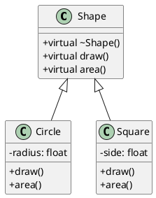
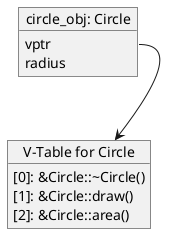
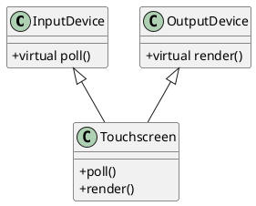
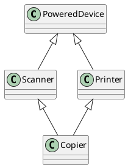
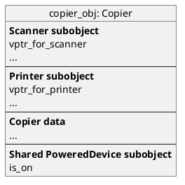

# The Ultimate Guide to C++ Virtual Tables

*A Deep Dive into the Mechanism Powering C++ Polymorphism, from Simple Inheritance to the Diamond Problem*

---

### **Table of Contents**
- [The Ultimate Guide to C++ Virtual Tables](#the-ultimate-guide-to-c-virtual-tables)
    - [**Table of Contents**](#table-of-contents)
  - [1. Introduction: The Heart of Polymorphism](#1-introduction-the-heart-of-polymorphism)
  - [2. The Core Mechanism: Single Inheritance and V-Tables](#2-the-core-mechanism-single-inheritance-and-v-tables)
    - [The `vptr` and the V-Table](#the-vptr-and-the-v-table)
    - [UML and Memory Layout](#uml-and-memory-layout)
      - [UML Class Diagram](#uml-class-diagram)
      - [V-Tables and Object Memory Layout](#v-tables-and-object-memory-layout)
    - [Dynamic Dispatch in Action](#dynamic-dispatch-in-action)
  - [3. Level Up: Multiple Inheritance](#3-level-up-multiple-inheritance)
    - [Memory Layout with Multiple V-Pointers](#memory-layout-with-multiple-v-pointers)
      - [UML Class Diagram](#uml-class-diagram-1)
      - [Memory Layout Table: `Touchscreen` Object](#memory-layout-table-touchscreen-object)
    - [Casting and Pointer Adjustment](#casting-and-pointer-adjustment)
  - [4. The Final Boss: The Diamond Problem \& Virtual Inheritance](#4-the-final-boss-the-diamond-problem--virtual-inheritance)
    - [The Problem: Ambiguity and Duplication](#the-problem-ambiguity-and-duplication)
      - [UML and Memory Layout (The Problem)](#uml-and-memory-layout-the-problem)
    - [The Solution: `virtual` Inheritance](#the-solution-virtual-inheritance)
    - [The V-Base Offset](#the-v-base-offset)
    - [Memory Layout and Casting Revisited](#memory-layout-and-casting-revisited)
      - [Memory Layout Table: `Copier` (With `virtual` Inheritance)](#memory-layout-table-copier-with-virtual-inheritance)
      - [Visualizing the Final Layout](#visualizing-the-final-layout)
    - [**Casting and Pointer Adjustment in Diamond Inheritance**](#casting-and-pointer-adjustment-in-diamond-inheritance)
      - [Diamond Inheritance with `virtual` keyword](#diamond-inheritance-with-virtual-keyword)
    - [Pointer Adjustments and Casting](#pointer-adjustments-and-casting)
    - [What g++ does internally (simplified):](#what-g-does-internally-simplified)
    - [Example Output (on x86\_64 with g++):](#example-output-on-x86_64-with-g)
    - [Summary of Casting in Diamond Inheritance](#summary-of-casting-in-diamond-inheritance)
    - [Notes on Downcasting](#notes-on-downcasting)
    - [RTTI for type casting](#rtti-for-type-casting)
  - [5. Practical Implications and Conclusion](#5-practical-implications-and-conclusion)
    - [Performance Considerations](#performance-considerations)
    - [Relevance in High-Performance Domains (e.g., FinTech)](#relevance-in-high-performance-domains-eg-fintech)
    - [Key Takeaways](#key-takeaways)

---

-----

## 1\. Introduction: The Heart of Polymorphism

In C++, **polymorphism** allows us to design flexible systems by treating objects of different classes in a uniform way through a common base class interface. When you call a member function on a base class pointer that points to a derived object, how does the program know *which* version of the function to execute?

The answer lies in one of C++'s most elegant implementation details: the **Virtual Table**, or **V-Table**. Mastering this concept is essential for any serious C++ developer, as it unlocks the true power of object-oriented design.

## 2\. The Core Mechanism: Single Inheritance and V-Tables

Let's start with a classic example: a `Shape` hierarchy.

```cpp
class Shape {
public:
    // A virtual destructor is ESSENTIAL for polymorphic hierarchies.
    virtual ~Shape() = default;
    virtual void draw() const { /* draws a generic shape */ }
    virtual float area() const { return 0.0f; }
};

class Circle : public Shape {
public:
    void draw() const override { /* draws a circle */ }
    float area() const override { /* returns circle area */ }
private:
    float radius;
};

class Square : public Shape {
public:
    void draw() const override { /* draws a square */ }
    float area() const override { /* returns square area */ }
private:
    float side;
};
```

### The `vptr` and the V-Table

To enable runtime polymorphism, the compiler performs two critical actions:

1.  **V-Table Creation**: For each class with `virtual` functions (`Shape`, `Circle`, `Square`), the compiler creates a single, static V-Table. This is a lookup table (an array of function pointers) for all virtual functions of that class.
2.  **The V-Pointer (`vptr`)**: Every object instance of these classes is endowed with a hidden member pointer, the **`vptr`**. This pointer is initialized by the constructor to point to the V-Table of the object's actual class. It's typically the very first member in the object's memory layout.

### UML and Memory Layout

#### UML Class Diagram



#### V-Tables and Object Memory Layout

The compiler generates these static tables somewhere in the program's data segment.

| V-Table for `Shape` | V-Table for `Circle` | V-Table for `Square` |
| :--- | :--- | :--- |
| `&Shape::~Shape` | `&Circle::~Circle` | `&Square::~Square` |
| `&Shape::draw` | `&Circle::draw` | `&Square::draw` |
| `&Shape::area` | `&Circle::area` | `&Square::area` |

Now, let's visualize the memory layout of an instance of `Circle`.



**Memory Layout Table: `Circle` Object**

| Offset | Member | Description |
| :--- | :--- | :--- |
| `+0` | `vptr` | Points to the `Circle` V-Table. (Size: 8 bytes on a 64-bit system) |
| `+8` | `radius` | The data member specific to `Circle`. (Size: 4 bytes) |

### Dynamic Dispatch in Action

Consider this code:

```cpp
Shape* shape_ptr = new Circle();
shape_ptr->draw(); // This is where the magic happens
```

This call is translated by the compiler into a sequence of operations equivalent to this:

1.  **Get `vptr`**: Access the `vptr` at the start of the object pointed to by `shape_ptr`.
    `vptr = *(shape_ptr)`
2.  **Get V-Table**: Dereference the `vptr` to get the address of the V-Table.
    `v_table = *vptr`
3.  **Get Function Address**: Get the function pointer at the known index for `draw()` (e.g., index 1).
    `function_address = v_table[1]`
4.  **Call Function**: Call the function at that address, passing the object's `this` pointer implicitly.
    `call(function_address, shape_ptr)`

Because `shape_ptr` points to a `Circle` object, its `vptr` points to the `Circle` V-Table, ensuring `Circle::draw()` is called. This is **dynamic dispatch**.

## 3\. Level Up: Multiple Inheritance

What happens when a class inherits from multiple base classes that have virtual functions?

```cpp
class InputDevice {
public:
    virtual void poll() { /* polls for input */ }
};

class OutputDevice {
public:
    virtual void render() { /* renders output */ }
};

class Touchscreen : public InputDevice, public OutputDevice {
public:
    void poll() override { /* touchscreen poll logic */ }
    void render() override { /* touchscreen render logic */ }
};
```

### Memory Layout with Multiple V-Pointers

An object of a class with multiple bases will contain a subobject for each base class. If a base class has a V-Table, its subobject will contain a `vptr`.

#### UML Class Diagram



#### Memory Layout Table: `Touchscreen` Object

A `Touchscreen` object contains **two** `vptr`s: one for each polymorphic base.

| Offset | Member | Description |
| :--- | :--- | :--- |
| `+0` | `vptr_InputDevice` | **(InputDevice subobject starts here)** Points to the `Touchscreen` V-Table section for `InputDevice`. |
| `+8` | `vptr_OutputDevice` | **(OutputDevice subobject starts here)** Points to the `Touchscreen` V-Table section for `OutputDevice`. |

### Casting and Pointer Adjustment

This layout has a critical implication for casting:

  * A `Touchscreen*` cast to an `InputDevice*` requires no change in the pointer's value.
  * A `Touchscreen*` cast to an `OutputDevice*` requires the pointer value to be adjusted by `+8` bytes to point to the start of the `OutputDevice` subobject. This adjustment is known as a **thunk**.

<!-- end list -->

```cpp
Touchscreen* ts = new Touchscreen();
InputDevice* in_ptr = ts;   // in_ptr == ts
OutputDevice* out_ptr = ts; // out_ptr == (char*)ts + 8
```

## 4\. The Final Boss: The Diamond Problem & Virtual Inheritance

This is the most complex scenario, where a class inherits from two bases that share a common ancestor.

### The Problem: Ambiguity and Duplication

```cpp
// Without virtual inheritance
class PoweredDevice { public: bool is_on; };
class Scanner : public PoweredDevice { /*...*/ };
class Printer : public PoweredDevice { /*...*/ };
class Copier : public Scanner, public Printer { /*...*/ };
```

#### UML and Memory Layout (The Problem)



An object of `Copier` would contain **two separate** `PoweredDevice` subobjects, leading to:

1.  **Ambiguity**: `copier.is_on` is a compile-time error. Which `is_on`?
2.  **State Duplication**: The copier logically has one power state, but the object has two.

**Memory Layout Table: `Copier` (Problematic)**

| Offset | Subobject / Member | Description |
| :--- | :--- | :--- |
| `+0` | `Scanner` subobject | |
| `+0` | `PoweredDevice` (from `Scanner`) | First copy of `is_on` |
| ... | `Printer` subobject | |
| ... | `PoweredDevice` (from `Printer`) | Second copy of `is_on` |

### The Solution: `virtual` Inheritance

The `virtual` keyword on an inheritance relationship tells the compiler to ensure only one instance of that base exists.

```cpp
class PoweredDevice { /*...*/ };
class Scanner : public virtual PoweredDevice { /*...*/ };
class Printer : public virtual PoweredDevice { /*...*/ };
class Copier : public Scanner, public Printer { /*...*/ };
```

### The V-Base Offset

To manage the single, shared `PoweredDevice` subobject, the compiler changes the memory layout drastically. The shared base is typically placed at the end of the object. To find it from a `Scanner*` or `Printer*`, the compiler uses a **v-base offset** stored in or near the V-Table.

### Memory Layout and Casting Revisited

#### Memory Layout Table: `Copier` (With `virtual` Inheritance)

| Offset | Member | Description |
| :--- | :--- | :--- |
| `+0` | `vptr_Scanner` | **(Scanner subobject)** Points to V-Table for `Copier`, contains **v-base offset** to find `PoweredDevice`. |
| ... | `Scanner` data members | |
| ... | `vptr_Printer` | **(Printer subobject)** Points to V-Table for `Copier`, contains **v-base offset** to find `PoweredDevice`. |
| ... | `Printer` data members | |
| ... | `Copier` data members | |
| `+N` | `PoweredDevice` subobject | **The single, shared instance.** |

#### Visualizing the Final Layout



### **Casting and Pointer Adjustment in Diamond Inheritance**

Let’s explore **how `g++` handles upcasting and downcasting** when dealing with **virtual inheritance**, particularly in the **diamond problem**.

#### Diamond Inheritance with `virtual` keyword

```cpp
#include <iostream>
using namespace std;

class Base {
public:
    virtual void who() const { cout << "Base\n"; }
    virtual ~Base() = default;
};

class Left : virtual public Base {
public:
    void who() const override { cout << "Left\n"; }
};

class Right : virtual public Base {
public:
    void who() const override { cout << "Right\n"; }
};

class Bottom : public Left, public Right {
public:
    void who() const override { cout << "Bottom\n"; }
};
```

In this classic **diamond**, `Bottom` inherits `Base` **virtually** through both `Left` and `Right`, meaning there's only **one shared `Base` subobject** in memory.

### Pointer Adjustments and Casting

Let’s add code to examine casting behavior:

```cpp

// cout overloaded operator "<<" for Left*
// std::ostream& operator<<(std::ostream& os, const Left* leftPtr) {
//     if (leftPtr == nullptr) {
//         os << "nullptr (Left*)"; // Handle null pointers gracefully
//     } else {
//         os << "Left Object [ID: " << leftPtr->getId()
//            << ", Name: \"" << leftPtr->getName() << "\"]";
//     }
//     return os;
// }

int main() {
    Bottom b;
    Base* basePtr = &b; // Upcast to virtual base
    basePtr->who();      // Output: Bottom

    Left* lptr = &b;
    Right* rptr = &b;

    /* unsafe, you have to be 100% sure that lptr can be casted to Right
       Otherwise you will get application crash - undefined behavior
    */
    Right* l2r = static_cast<Right*>(lptr); 
    /* dynamic_cast - is a safe cast for runtime. When you are not sure what is under lptr, you should use dynamic_cast.
    used in runtime for safe casting. if the cast fails it will return nullptr
    */ 
    Right* l2r = dynamic_cast<Right*>(lptr);
    if(nullptr == l2r)   {
      cout << "Failed to cast to Right from the Left\n";
    }  else   {
      cout << "Left casted to Right\n";
      l2r->who();
    }


    Base* basePtr2 = new Left();

    auto p = static_cast<Bottom*>(basePtr2)
    p->who();

    void* p = new Left();

     std::cout << "Type of Left: " << typeid(Left).name() << std::endl;

    cout << "lptr:  " << lptr << '\n'; // To print the memory address. If the "cout operator << " will be overloaded for Left*, it will use it instead if printing the address
    cout << "lptr:  " << (void*)lptr << '\n'; // C-style cast to void* for printing
    cout << "rptr:  " << static_cast<void*>(rptr) << '\n'; // static_cast<void*> is for guaranteed printing of the memory address
    cout << "base:  " << static_cast<void*>(basePtr) << '\n';

    Base* via_left = lptr;
    Base* via_right = rptr;

    cout << "via_left Base*:  " << static_cast<void*>(via_left) << '\n';
    cout << "via_right Base*: " << static_cast<void*>(via_right) << '\n';
}
```

### What g++ does internally (simplified):

  * `Bottom` has only **one `Base` vptr**, located at a shared location because of **virtual inheritance**.
  * Both `Left` and `Right` **contain a pointer or offset** to the shared `Base` subobject.
  * When converting `Left*` or `Right*` to `Base*`, the compiler **performs a pointer adjustment** to find the actual `Base` inside `Bottom`.

### Example Output (on x86\_64 with g++):

```
Bottom
lptr:  0x7ffee5fbfbc0
rptr:  0x7ffee5fbfbc8
base:  0x7ffee5fbfbd0
via_left Base*:  0x7ffee5fbfbd0
via_right Base*: 0x7ffee5fbfbd0
```

> Notice how both `lptr` and `rptr` have different addresses, but after converting to `Base*`, both point to the **same virtual base subobject**.

-----

### Summary of Casting in Diamond Inheritance

| Cast Type                               | Action by `g++`                                                                                                  |
| --------------------------------------- | ----------------------------------------------------------------------------------------------------------------- |
| `Bottom* -> Base*`                      | Pointer is adjusted to the virtual `Base` subobject.                                                              |
| `Left* -> Base*` or `Right* -> Base*`   | Uses virtual base offset to reach shared `Base`.                                                                  |
| `Base* -> Left*`                        | Requires RTTI or unsafe cast (via `dynamic_cast` or `reinterpret_cast`) and reverse offset logic.                 |
| `Left* <-> Right*`                      | Not directly convertible without going through `Bottom*`.                                                         |

-----

### Notes on Downcasting

```cpp
Base* base = new Bottom();
Bottom* bottom = dynamic_cast<Bottom*>(base);
if (bottom) bottom->who();  // Safe downcast with RTTI
```

  * `dynamic_cast` safely handles pointer adjustments by using RTTI and the complete object layout.
  * `reinterpret_cast` does **not** adjust pointers and can cause undefined behavior in this context.

### RTTI for type casting

Run-Time Type Information (RTTI) in C++ provides a mechanism to determine the type of an object during program execution. The `dynamic_cast` operator is the primary tool that leverages RTTI to perform safe downcasting and cross-casting within a polymorphic class hierarchy.

Here's how `dynamic_cast` typically works with RTTI:

1.  **Polymorphic Requirement:** `dynamic_cast` can only be used with polymorphic types, meaning the class must have at least one virtual function. This is because the presence of virtual functions ensures that each object instance has a `vptr` (virtual pointer) that points to its class's V-Table. The V-Table, in turn, contains the necessary RTTI.

2.  **RTTI Data in V-Table:** Alongside the pointers to virtual functions, the V-Table (or a related data structure pointed to by an entry in the V-Table) stores additional RTTI. This RTTI includes information about the class itself, its base classes, and their relationships. This data is specific to each class.

3.  **Runtime Check:** When you use `dynamic_cast<TargetType*>(source_ptr)`, the compiler generates code that:
    * Retrieves the `vptr` from the `source_ptr` to find the object's actual (dynamic) type information.
    * Compares the dynamic type of the object pointed to by `source_ptr` with the `TargetType`. This comparison involves traversing the inheritance hierarchy using the RTTI data.
    * If the `source_ptr` points to an object of `TargetType` or a type derived from `TargetType`, the cast is successful.
    * If the cast is valid but requires a pointer adjustment (as seen in multiple or virtual inheritance, where the target subobject might not be at the same memory address as the `source_ptr`), `dynamic_cast` calculates and applies this offset. This adjustment is sometimes referred to as a "thunk."

4.  **Result on Success/Failure:**
    * **Pointers:** If the cast is successful, `dynamic_cast` returns a valid pointer to the `TargetType` subobject. If the cast fails (meaning the object is not of the `TargetType` or a derived type), it returns a `nullptr`.
    * **References:** If `dynamic_cast` is used with references (`dynamic_cast<TargetType&>(source_ref)`), and the cast fails, it throws a `std::bad_cast` exception.

**Key Aspects of RTTI in `dynamic_cast`:**

* **Downcasting and Cross-casting:** `dynamic_cast` is primarily used for downcasting (casting a base class pointer/reference to a derived class pointer/reference) and cross-casting (casting between two unrelated derived classes that share a common polymorphic base).
* **Safety:** Unlike `static_cast` or `reinterpret_cast`, `dynamic_cast` provides runtime safety by verifying the type before performing the conversion. This prevents undefined behavior that could arise from an invalid cast.
* **Overhead:** The runtime check and potential pointer adjustments incur a slight performance overhead compared to compile-time casts. For this reason, `dynamic_cast` is typically used when the exact type of an object is not known at compile time and needs to be determined dynamically.

In essence, RTTI empowers `dynamic_cast` to make intelligent decisions at runtime about the validity and necessary adjustments for type conversions within a polymorphic hierarchy.

To learn more about dynamic casting and RTTI in C++, you can watch this video: [Dynamic cast c++ Runtime Type Identification example why we use dynamic cast - RTTI](https://www.youtube.com/watch?v=2PXN7Zk9v80).
http://googleusercontent.com/youtube_content/0

## 5\. Practical Implications and Conclusion

### Performance Considerations

  * **Memory:** Each polymorphic object has an overhead of one `vptr` (or more in multiple inheritance).
  * **Speed:** A virtual function call involves a few extra memory lookups and an indirect call, making it slightly slower than a direct call. This cost is usually negligible but can be a factor in tight performance-critical loops.

### Relevance in High-Performance Domains (e.g., FinTech)

In FinTech, systems must be precise, performant, and highly extensible. The principles of polymorphism are critical for building robust trading, risk, and compliance systems.

Consider a system for pricing financial instruments. You might have a base class `TradableAsset` with a virtual function `double getCurrentValue() const`. Derived classes could be `Stock`, `Bond`, `Option`, and `Future`. A portfolio can hold a `std::vector<TradableAsset*>` and calculate its total value by calling `getCurrentValue()` on each element. Thanks to the V-Table, the correct, highly-specialized pricing logic is invoked for each asset. This allows the system to be easily extended with new financial products without modifying the core portfolio logic—a crucial feature in a fast-evolving financial landscape.

### Key Takeaways

>   - **Polymorphism is powered by V-Tables and `vptr`s.**
>   - Every object of a polymorphic class has a hidden `vptr` pointing to its class's V-Table.
>   - A virtual function call is an indirect call resolved at runtime (**dynamic dispatch**).
>   - **Always declare a virtual destructor** in polymorphic base classes.
>   - Multiple inheritance adds multiple `vptr`s to an object's layout.
>   - The **Diamond Problem** (ambiguity and duplication) is solved by **`virtual` inheritance**.
>   - Virtual inheritance uses **v-base offsets** to locate the shared base subobject, making the memory layout more complex and introducing runtime costs for certain casts.
