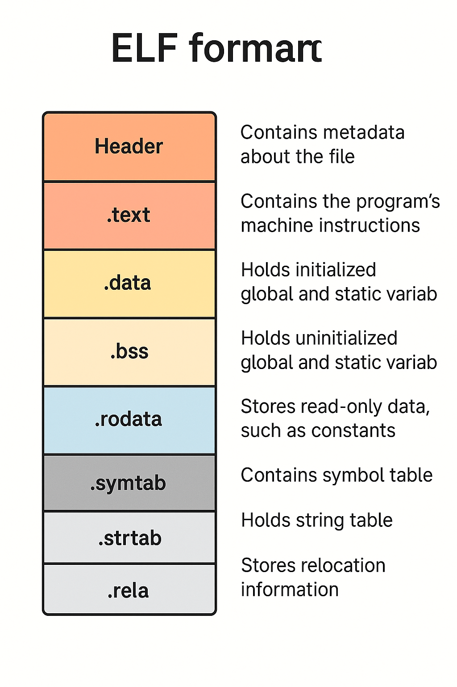
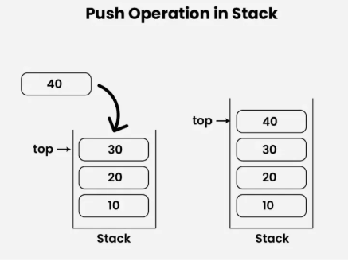

- [C++ Memory Management: From Basics to Custom Allocators](#c-memory-management-from-basics-to-custom-allocators)
  - [Lecture Overview](#lecture-overview)
  - [1. C++ Memory Model: The Foundation](#1-c-memory-model-the-foundation)
    - [What is Memory Model?](#what-is-memory-model)
    - [Memory Regions in C++](#memory-regions-in-c)
      - [Advanced](#advanced)
      - [1. Minimal stack overflow code (advanced)](#1-minimal-stack-overflow-code-advanced)
      - [2. One of the absolute worst performance scenarios for 'new' operator (advanced)](#2-one-of-the-absolute-worst-performance-scenarios-for-new-operator-advanced)
      - [3. Static Initialization Order Initialization](#3-static-initialization-order-initialization)
        - [Static Variables in the Same Translation Unit](#static-variables-in-the-same-translation-unit)
        - [The "Static Initialization Order Fiasco"](#the-static-initialization-order-fiasco)
      - [Process memory, stack allocation](#process-memory-stack-allocation)
        - [When is the Stack Allocated?](#when-is-the-stack-allocated)
        - [Where is the Stack Located?](#where-is-the-stack-located)
      - [The C++ stack implements LIFO (Last In, First Out) behavior.](#the-c-stack-implements-lifo-last-in-first-out-behavior)
  - [2. Object Lifetime: When Things Live and Die](#2-object-lifetime-when-things-live-and-die)
    - [Stack Objects - Automatic Lifetime](#stack-objects---automatic-lifetime)
    - [Heap Objects - Manual Lifetime](#heap-objects---manual-lifetime)
    - [RAII - Resource Acquisition Is Initialization](#raii---resource-acquisition-is-initialization)
  - [3. Smart Pointers: Automatic Memory Management](#3-smart-pointers-automatic-memory-management)
    - [unique\_ptr - Single Ownership](#unique_ptr---single-ownership)
    - [shared\_ptr - Shared Ownership](#shared_ptr---shared-ownership)
  - [4. Custom Allocators: Taking Full Control](#4-custom-allocators-taking-full-control)
    - [Why Custom Allocators?](#why-custom-allocators)
    - [Simple Custom Allocator](#simple-custom-allocator)
      - [Wrapper Allocator or Tracking Allocator](#wrapper-allocator-or-tracking-allocator)
    - [Memory Pool Allocator](#memory-pool-allocator)
    - [Custom allocators types](#custom-allocators-types)
  - [5. Memory Management Best Practices](#5-memory-management-best-practices)
    - [Rule of Three/Five/Zero](#rule-of-threefivezero)
    - [Modern C++ Approach (Rule of Zero)](#modern-c-approach-rule-of-zero)
  - [6. Common Memory Management Mistakes](#6-common-memory-management-mistakes)
    - [1. Memory Leaks](#1-memory-leaks)
    - [2. Dangling Pointers](#2-dangling-pointers)
    - [3. Double Delete](#3-double-delete)
    - [4. Use After Free](#4-use-after-free)
  - [7. Tools for Memory Management](#7-tools-for-memory-management)
    - [Valgrind (Linux/Mac)](#valgrind-linuxmac)
    - [AddressSanitizer (GCC/Clang)](#addresssanitizer-gccclang)
    - [Visual Studio Diagnostic Tools (Windows)](#visual-studio-diagnostic-tools-windows)
  - [Summary](#summary)
  - [Usage example](#usage-example)

# C++ Memory Management: From Basics to Custom Allocators

## Lecture Overview
Today we'll explore how C++ manages memory and how you can take control of this process. We'll start with the basics and gradually move to advanced topics.

---

## 1. C++ Memory Model: The Foundation

### What is Memory Model?
Think of computer memory like a huge apartment building. Each apartment has an address, and you can store things in each apartment. The C++ memory model defines:
- How memory is organized
- Where different types of data live
- How long they stay alive
- Who is responsible for cleaning up

### Memory Regions in C++

C++ divides memory into several regions:

```cpp
#include <iostream>

int global_var = 42;        // Global/Static memory
static int static_var = 10; // Global/Static memory

class C
{
public:
    C() {  std::cout << "C ctor\n"; }
    ~C() { std::cout << "~C dtor\n"; }
};

void demonstrate_memory_regions() {

    int local_var = 20;           // Stack memory
    int* heap_ptr = new int(30);  // Heap memory
    C c;
    
    
    std::cout << "Global variable address: " << &global_var << std::endl;
    std::cout << "Static variable address: " << &static_var << std::endl;
    std::cout << "Local variable address: " << &local_var << std::endl;
    std::cout << "Heap variable address: " << heap_ptr << std::endl;
    
    delete heap_ptr; // Clean up heap memory
}
```

Possible output:

```
C ctor
Global variable address: 0x62348778a010
Static variable address: 0x62348778a014
Local variable address: 0x7ffeca75887c
Heap variable address: 0x62348b0032b0
~C dtor
```

**Memory Regions Explained:**

1. **Stack Memory**
   - Fast allocation/deallocation
   - Automatic cleanup
   - Limited size (usually 1-8 MB)
   - Variables disappear when function ends

2. **Heap Memory** 
   - Slower allocation/deallocation
   - Manual cleanup required
   - Large size (limited by system RAM)
   - Variables stay until you delete them

3. **Global/Static Memory**
   - Exists for entire program lifetime
   - Initialized before main() starts
   - Cleaned up after main() ends


#### Advanced

```cpp
#include <iostream>

int global_var = 42;        // Global/Static memory. Stored in .data
static int static_var = 10; // Global/Static memory. Stored in .data

void func() {
    static char local_static_initialized_var = 'A'; // Stored in .data
}

int global_uninitialized_var; // Stored in .bss (implicitly initialized to 0)
static long static_uninitialized_var; // Stored in .bss (implicitly initialized to 0)
int global_explicit_zero_var = 0; // Stored in .bss (compiler optimization)

void func() {
    static double local_static_uninitialized_var; // Stored in .bss (implicitly initialized to 0)
}

const int global_const_var = 100; // Stored in .rodata
char* my_string = "Hello, world!"; // "Hello, world!" is a string literal, stored in .rodata

void demonstrate_memory_regions() {
    int local_var = 20;           // Stack memory
    int* heap_ptr = new int(30);  // Heap memory
    
    std::cout << "Global variable address: " << &global_var << std::endl;
    std::cout << "Static variable address: " << &static_var << std::endl;
    std::cout << "Local variable address: " << &local_var << std::endl;
    std::cout << "Heap variable address: " << heap_ptr << std::endl;
    
    delete heap_ptr; // Clean up heap memory
}
```

#### 1. Minimal stack overflow code (advanced)

```cpp
void stackOverflow(double a)
{
     std::cout << "a: " << a << "\n";
     stackOverflow(a+1);
}
```

#### 2. One of the absolute worst performance scenarios for 'new' operator (advanced)

 When memory allocated by new (which resides in the program's virtual address space) gets written to the swap file (or swap partition on Linux), it means the operating system has paged out that memory from physical RAM to disk.

* **RAM Access:** Measured in nanoseconds (ns).
* **SSD Access:** Measured in microseconds (µs) to milliseconds (ms) – thousands to millions of times slower than RAM.
* **HDD Access:** Measured in milliseconds (ms) – millions of times slower than RAM.

#### 3. Static Initialization Order Initialization

##### Static Variables in the Same Translation Unit

Variables with static storage duration in the same translation unit (source file) are initialized in the order they appear in the source code. This is well-defined and predictable.

```cpp
int a = 10;
int b = a + 5;  // b is initialized after a, so this works fine
```

##### The "Static Initialization Order Fiasco"

The problematic case occurs with static variables across different translation units. The C++ standard before C++20 stated that the initialization order of static variables in different translation units is undefined. This creates the famous "static initialization order fiasco."

#### Process memory, stack allocation

The stack for a process is allocated and managed by the operating system during program loading and execution. Here are the stages and location of the stack:

##### When is the Stack Allocated?
Stack allocation occurs during the **program loading and process initialization** phase.

When you launch a program (for example, by running `ls` in the terminal or double-clicking a program icon):

* The operating system kernel receives a request to create a new process.
* It creates a new entry in the process table and allocates a **virtual address space** for this process.
* The program loader (part of the kernel or dynamic linker) reads the ELF file (or another executable file format).
* Based on information from the program headers (especially **PT_LOAD segments**), the kernel maps code sections, data, and other necessary file regions into the new process's virtual address space.
* At this same stage, the kernel allocates a specific region in the virtual address space for the **stack**. This is typically done by mapping anonymous memory pages (i.e., not tied to a file on disk) into the upper part of the process's virtual address space. The initial stack size is usually fixed (e.g., 8 MB on most Linux systems by default), but it can **dynamically expand** as needed.
* The **Stack Pointer (SP**, or RSP/ESP on x86/x64) is initialized to an address pointing to the "top" of the allocated stack. On most architectures, the stack "grows downwards," towards lower memory addresses.
* After all necessary structures are initialized, control is transferred to the program's entry point (usually `_start` or `main`).

---

##### Where is the Stack Located?

The stack is located within the **process's virtual address space**.

Here's a typical simplified memory organization diagram within a process's virtual address space (many details depend on the architecture and OS):

```
+------------------+ <--- High Addresses (e.g., 0xFFFFFFFF for 32-bit)
|                  |
|    Command-Line  |
|      Arguments   |
|                  |
+------------------+
|                  |
|    Environment   |
|     Variables    |
|                  |
+------------------+
|                  |
|       Stack      | (grows downwards)
|         ^        |
|         |        |
|         |        |
+------------------+
|                  |
|      (Free)      |
|                  |
+------------------+
|                  |
|       Heap       | (grows upwards)
|         |        |
|         v        |
+------------------+
|                  |
|    .bss (uninitialized data) |
|    .data (initialized data)  |
|    .rodata (read-only data)  |
|    .text (code)              |
|                  |
+------------------+ <--- Low Addresses (e.g., 0x00000000)
```




#### The C++ stack implements LIFO (Last In, First Out) behavior.

Let me show you how this works:



```cpp
void demonstrate_stack_lifo() {
    std::cout << "Function starts" << std::endl;
    
    {
        int first = 1;
        std::cout << "Created first variable" << std::endl;
        
        {
            int second = 2;
            std::cout << "Created second variable" << std::endl;
            
            {
                int third = 3;
                std::cout << "Created third variable" << std::endl;
                
                // third destructor called here (Last In, First Out)
            }
            std::cout << "third is destroyed" << std::endl;
            
            // second destructor called here
        }
        std::cout << "second is destroyed" << std::endl;
        
        // first destructor called here
    }
    std::cout << "first is destroyed" << std::endl;
}
```
**Output:**
```
Function starts
Created first variable
Created second variable
Created third variable
third is destroyed
second is destroyed
first is destroyed
```

**Why LIFO?**

The stack grows "upward" in memory (conceptually). When you declare variables:
- They get "pushed" onto the stack
- When they go out of scope, they get "popped" off the stack
- The last variable created is the first to be destroyed

**With Objects:**
```cpp
class Demo {
    int id;
public:
    Demo(int i) : id(i) {
        std::cout << "Demo " << id << " created" << std::endl;
    }
    
    ~Demo() {
        std::cout << "Demo " << id << " destroyed" << std::endl;
    }
};

void stack_lifo_objects() {
    Demo first(1);
    Demo second(2);
    Demo third(3);
    
    // Output when function ends:
    // Demo 3 destroyed  (Last In, First Out)
    // Demo 2 destroyed
    // Demo 1 destroyed
}
```

This LIFO behavior is automatic and guaranteed by the C++ standard. It's one of the key features that makes RAII work reliably!

## 2. Object Lifetime: When Things Live and Die

### Stack Objects - Automatic Lifetime

```cpp
void stack_example() {
    // Object created when we reach this line
    std::string message = "Hello World";
    
    // Object automatically destroyed when function ends
    // No need for manual cleanup!
}
```

**Key Points:**
- Objects are created when declared
- Objects are destroyed when they go out of scope
- Destruction happens in reverse order of creation
- No memory leaks possible with pure stack objects

### Heap Objects - Manual Lifetime

```cpp
void heap_example() {
    // Create object on heap
    std::string* message = new std::string("Hello World");
    
    // Use the object
    std::cout << *message << std::endl;
    
    // MUST manually delete - or memory leak!
    delete message;
    message = nullptr; // Good practice
}
```

**Common Mistakes:**
```cpp
void bad_example() {
    std::string* msg = new std::string("Hello");
    // Forgot to delete - MEMORY LEAK!
    
    std::string* msg2 = new std::string("World");
    delete msg2;
    delete msg2; // Double delete - CRASH!
}
```

### RAII - Resource Acquisition Is Initialization

RAII is a fundamental C++ concept. The idea is simple:
- Acquire resources in constructor
- Release resources in destructor
- Let the compiler manage lifetime

```cpp
class FileHandler {
private:
    FILE* file;
    
public:
    FileHandler(const char* filename) {
        file = fopen(filename, "r");
        if (!file) {
            throw std::runtime_error("Cannot open file");
        }
    }
    
    ~FileHandler() {
        if (file) {
            fclose(file);
        }
    }
    
    // Prevent copying for simplicity
    FileHandler(const FileHandler&) = delete;
    FileHandler& operator=(const FileHandler&) = delete;
};

void raii_example() {
    FileHandler handler("data.txt");
    // File automatically closed when handler goes out of scope
    // Even if exception is thrown!
}
```

---

## 3. Smart Pointers: Automatic Memory Management

Smart pointers solve the manual memory management problem:

### unique_ptr - Single Ownership

```cpp
#include <memory>

void unique_ptr_example() {
    // Create unique_ptr
    std::unique_ptr<int> ptr = std::make_unique<int>(42);
    
    // Use like regular pointer
    std::cout << *ptr << std::endl;
    
    // Automatic cleanup when ptr goes out of scope
    // No delete needed!
}

class Widget {
public:
    Widget(int id) : id_(id) {
        std::cout << "Widget " << id_ << " created" << std::endl;
    }
    
    ~Widget() {
        std::cout << "Widget " << id_ << " destroyed" << std::endl;
    }
    
private:
    int id_;
};

void ownership_transfer() {
    auto widget1 = std::make_unique<Widget>(1);
    auto widget2 = std::move(widget1); // Transfer ownership
    
    // widget1 is now empty (nullptr)
    // widget2 owns the Widget
}
```

### shared_ptr - Shared Ownership

```cpp
void shared_ptr_example() {
    auto ptr1 = std::make_shared<Widget>(2);
    std::cout << "Reference count: " << ptr1.use_count() << std::endl; // 1
    
    {
        auto ptr2 = ptr1; // Share ownership
        std::cout << "Reference count: " << ptr1.use_count() << std::endl; // 2
    } // ptr2 goes out of scope
    
    std::cout << "Reference count: " << ptr1.use_count() << std::endl; // 1
    // Widget destroyed when last shared_ptr is destroyed
}
```

---

## 4. Custom Allocators: Taking Full Control

### Why Custom Allocators?

Sometimes you need more control:
- Performance optimization
- Memory tracking
- Special memory requirements
- Pool allocation for many small objects

### Simple Custom Allocator

#### Wrapper Allocator or Tracking Allocator

```cpp

#include <memory>
#include <iostream>

template<typename T>
class TrackingAllocator {
public:
    using value_type = T;
    
    TrackingAllocator() = default;
    
    template<typename U>
    TrackingAllocator(const TrackingAllocator<U>&) noexcept {}
    
    T* allocate(size_t n) {
        std::cout << "Allocating " << n << " objects of size " << sizeof(T) << std::endl;
        return static_cast<T*>(std::malloc(n * sizeof(T)));
    }
    
    void deallocate(T* ptr, size_t n) {
        std::cout << "Deallocating " << n << " objects" << std::endl;
        std::free(ptr);
    }
};

template<typename T, typename U>
bool operator==(const TrackingAllocator<T>&, const TrackingAllocator<U>&) {
    return true;
}

template<typename T, typename U>
bool operator!=(const TrackingAllocator<T>&, const TrackingAllocator<U>&) {
    return false;
}

void custom_allocator_example() {
    std::vector<int, TrackingAllocator<int>> vec;
    
    vec.push_back(1);
    vec.push_back(2);
    vec.push_back(3);
    
    // You'll see allocation messages
}
```

### Memory Pool Allocator

```cpp
template<typename T, size_t PoolSize = 1024>
class PoolAllocator {
private:
/*
1. alignas is indeed related to the alignment of structures and is crucial for the correct operation of reinterpret_cast in this code. It ensures that the memory address of the structure (or its members) starts at a specific boundary, which is often a requirement for low-level operations like reinterpret_cast or for optimal performance with certain hardware architectures (like GPUs or SIMD instructions). Without proper alignment, reinterpret_cast could lead to undefined behavior or crashes when trying to access misaligned data.
2. T pool_[PoolSize]; will allocate the objects calling their constructors, but we want only to allocate the memory without interfering with the objects lifecycle. 
*/
    alignas(T) char pool_[PoolSize * sizeof(T)];
    bool used_[PoolSize]; // used to track free\taken memory inside the pool_ . index of used_ is equal to index of pool_
    
public:
    using value_type = T;
    
    PoolAllocator() {
        // https://en.cppreference.com/w/cpp/algorithm/fill.html
        // void fill( ForwardIt first, ForwardIt last, const T& value );
        // Assigns the given value to all elements in the range [first, last).
        std::fill(used_, used_ + PoolSize, false);
    }
    
    T* allocate(size_t n) {
        if (n != 1) {
            throw std::bad_alloc(); // Simple implementation
        }
        
        // Find unused index in pool_ and return it
        for (size_t i = 0; i < PoolSize; ++i) {
            if (!used_[i]) {
                used_[i] = true;
                return reinterpret_cast<T*>(pool_ + i * sizeof(T));
            }
        }
        
        throw std::bad_alloc(); // Pool exhausted
    }
    
    void deallocate(T* ptr, size_t n) {
        if (n != 1) return;
        
        char* char_ptr = reinterpret_cast<char*>(ptr);
        size_t index = (char_ptr - pool_) / sizeof(T);
        
        if (index < PoolSize) {
            used_[index] = false;
        }
    }
};
```

### Custom allocators types

Here is a list of common custom memory allocators with a brief description of their purpose:

* **Memory Pool (or Object Pool)**
    * **Purpose:** Designed for frequent allocation and deallocation of many objects of the **same fixed size**. It pre-allocates a large block of memory and divides it into fixed-size slots, offering very fast allocation/deallocation and reducing fragmentation for that specific object size.

* **Memory Arena Allocator (or Linear Allocator, Bump Allocator)**
    * **Purpose:** Provides extremely fast memory allocation by simply incrementing a pointer within a pre-allocated large block (the arena). It's ideal for objects that have a **similar lifetime** and can be deallocated all at once (by resetting the arena pointer) rather than individually.

* **Stack Allocator**
    * **Purpose:** Similar to an arena allocator, but it enforces a **Last-In, First-Out (LIFO)** deallocation order. Memory can only be freed from the "top" of the stack. It's used for temporary objects with strictly nested lifetimes, like those within a single function scope or game frame.

* **Free List Allocator**
    * **Purpose:** Manages a pool of memory using a linked list of free blocks. It's more flexible than a simple pool allocator as it can handle allocation requests for **various sizes**. It's a general-purpose custom allocator that aims to be faster than `malloc`/`free` by avoiding system calls.

* **Buddy Allocator**
    * **Purpose:** Divides memory into blocks whose sizes are powers of two. It's efficient for managing memory where allocation requests tend to be for sizes that are powers of two, commonly used in operating system kernels for page management.

* **Slab Allocator**
    * **Purpose:** Highly specialized allocator that manages pools of objects of a **specific type** (or size) by grouping them into "slabs" (larger memory blocks). It's often used in operating system kernels to efficiently allocate frequently used kernel objects, reducing overhead and improving cache performance.

* **TLSF (Two-Level Segregated Fit) Allocator**
    * **Purpose:** A high-performance general-purpose allocator designed for real-time systems and applications requiring predictable and fast allocation/deallocation times (often O(1) complexity). It uses a two-level system of segregated free lists.

* **Mimalloc / jemalloc / tcmalloc**
    * **Purpose:** These are modern, highly optimized, general-purpose memory allocators designed to replace the default system `malloc`/`free`. They are built for high concurrency and performance in multi-threaded environments, often employing techniques like thread-local caching and sophisticated heap management to minimize contention and fragmentation.

---

## 5. Memory Management Best Practices

### Rule of Three/Five/Zero

```cpp
class Resource {
private:
    int* data;
    size_t size;
    
public:
    // Constructor
    Resource(size_t s) : size(s), data(new int[s]) {}
    
    // Destructor
    ~Resource() {
        delete[] data;
    }
    
    // Copy constructor
    Resource(const Resource& other) : size(other.size), data(new int[size]) {
        std::copy(other.data, other.data + size, data);
    }
    
    // Copy assignment
    Resource& operator=(const Resource& other) {
        if (this != &other) {
            delete[] data;
            size = other.size;
            data = new int[size];
            std::copy(other.data, other.data + size, data);
        }
        return *this;
    }
    
    // Move constructor (C++11)
    Resource(Resource&& other) noexcept : size(other.size), data(other.data) {
        other.data = nullptr;
        other.size = 0;
    }
    
    // Move assignment (C++11)
    Resource& operator=(Resource&& other) noexcept {
        if (this != &other) {
            delete[] data;
            size = other.size;
            data = other.data;
            other.data = nullptr;
            other.size = 0;
        }
        return *this;
    }
};
```

### Modern C++ Approach (Rule of Zero)

```cpp
class ModernResource {
private:
    std::vector<int> data; // Handles memory automatically
    
public:
    ModernResource(size_t size) : data(size) {}
    
    // No need for destructor, copy/move constructors/assignments
    // std::vector handles everything!
};
```

---

## 6. Common Memory Management Mistakes

### 1. Memory Leaks
```cpp
void leak_example() {
    int* ptr = new int(42);
    // Forgot delete - LEAK!
}
```

### 2. Dangling Pointers
```cpp
int* dangling_example() {
    int local = 42;
    return &local; // Returns address of destroyed object!
}
```

### 3. Double Delete
```cpp
void double_delete_example() {
    int* ptr = new int(42);
    delete ptr;
    delete ptr; // CRASH!
}
```

### 4. Use After Free
```cpp
void use_after_free_example() {
    int* ptr = new int(42);
    delete ptr;
    *ptr = 10; // UNDEFINED BEHAVIOR!
}
```

---

## 7. Tools for Memory Management

### Valgrind (Linux/Mac)
```bash
valgrind --leak-check=full ./your_program
```

### AddressSanitizer (GCC/Clang)
```bash
g++ -fsanitize=address -g program.cpp
```

### Visual Studio Diagnostic Tools (Windows)
Built-in memory leak detection and profiling.

---

## Summary

**Key Takeaways:**
1. Understand the memory model - stack vs heap vs global
2. Use RAII principle for automatic resource management
3. Prefer smart pointers over raw pointers
4. Custom allocators for performance-critical code
5. Follow Rule of Three/Five/Zero
6. Use tools to detect memory issues

**Next Steps:**
- Practice with smart pointers
- Implement your own simple allocator
- Use memory debugging tools
- Study existing allocator implementations

Remember: Modern C++ makes memory management much safer and easier than old C++. When in doubt, use standard library containers and smart pointers!


---

## Usage example

```cpp
#include <iostream>  // For std::cout
#include <vector>    // For std::vector
#include <algorithm> // For std::fill (used in PoolAllocator)
#include <string>    // For std::string, if we want to test with a more complex type

// --- PoolAllocator Definition (as provided by you) ---
template<typename T, size_t PoolSize = 1024>
class PoolAllocator {
private:
    /*
    1. alignas is indeed related to the alignment of structures and is crucial for the correct operation of reinterpret_cast in this code. It ensures that the memory address of the structure (or its members) starts at a specific boundary, which is often a requirement for low-level operations like reinterpret_cast or for optimal performance with certain hardware architectures (like GPUs or SIMD instructions). Without proper alignment, reinterpret_cast could lead to undefined behavior or crashes when trying to access misaligned data.
    2. T pool_[PoolSize]; will allocate the objects calling their constructors, but we want only to allocate the memory without interfering with the objects lifecycle.
    */
    alignas(T) char pool_[PoolSize * sizeof(T)];
    bool used_[PoolSize]; // used to track free\taken memory inside the pool_ . index of used_ is equal to index of pool_

public:
    using value_type = T;

    PoolAllocator() {
        // https://en.cppreference.com/w/cpp/algorithm/fill.html
        // void fill( ForwardIt first, ForwardIt last, const T& value );
        // Assigns the given value to all elements in the range [first, last).
        std::fill(used_, used_ + PoolSize, false);
        std::cout << "PoolAllocator constructed. Pool size: " << PoolSize << " elements of type " << sizeof(T) << " bytes." << std::endl;
    }

    // Copy constructor for allocator (required by standard library)
    template<typename U>
    PoolAllocator(const PoolAllocator<U>&) noexcept {
        // For stateless allocators like this one, copying doesn't need to do anything
        // as all instances behave the same.
        std::cout << "PoolAllocator copy-constructed." << std::endl;
    }

    T* allocate(size_t n) {
        if (n != 1) {
            // This PoolAllocator is a simplified version and can only allocate one object at a time.
            // Standard containers like std::vector might ask for more than one (e.g., when resizing).
            // For a robust allocator, this would need to be handled, perhaps by falling back to std::malloc
            // for larger requests, or by implementing a more complex block allocation strategy.
            std::cerr << "Error: PoolAllocator currently only supports allocating 1 object at a time. Requested: " << n << std::endl;
            throw std::bad_alloc();
        }

        // Find unused index in pool_ and return it
        for (size_t i = 0; i < PoolSize; ++i) {
            if (!used_[i]) {
                used_[i] = true;
                std::cout << "Allocating " << n << " object(s) of size " << sizeof(T) << " bytes at index " << i << std::endl;
                return reinterpret_cast<T*>(pool_ + i * sizeof(T));
            }
        }

        std::cerr << "Error: Pool exhausted for " << typeid(T).name() << "!" << std::endl;
        throw std::bad_alloc(); // Pool exhausted
    }

    void deallocate(T* ptr, size_t n) {
        // Our simplified deallocate also expects n=1.
        // For a robust allocator, you'd need to handle n > 1 if allocate could.
        if (n != 1) {
            std::cerr << "Warning: PoolAllocator deallocate received n != 1. Ignoring." << std::endl;
            return;
        }

        char* char_ptr = reinterpret_cast<char*>(ptr);
        // Calculate the index of the slot being deallocated
        size_t index = (char_ptr - pool_) / sizeof(T);

        // Basic check to ensure the pointer is within our pool's bounds
        if (index < PoolSize) {
            if (used_[index]) { // Only deallocate if it was actually marked as used
                used_[index] = false;
                std::cout << "Deallocating " << n << " object(s) at index " << index << std::endl;
            } else {
                std::cerr << "Warning: Attempted to deallocate unused or out-of-pool memory at index " << index << std::endl;
            }
        } else {
            std::cerr << "Error: Attempted to deallocate memory outside of pool bounds." << std::endl;
            // In a real scenario, you might want to call std::free(ptr) here
            // if you expect to handle memory not allocated by this pool (e.g., fallback strategy).
        }
    }
};

// --- Required Equality Operators for Allocators ---
// These are necessary for standard containers to work with custom allocators.
// For stateless allocators like PoolAllocator, they always return true.
template<typename T, typename U>
bool operator==(const PoolAllocator<T>&, const PoolAllocator<U>&) {
    return true;
}

template<typename T, typename U>
bool operator!=(const PoolAllocator<T>&, const PoolAllocator<U>&) {
    return false;
}

// --- Main Function to Demonstrate Usage ---
int main() {
    std::cout << "--- Demonstrating PoolAllocator with std::vector<int> ---" << std::endl;
    { // Using a scope to ensure vector's destructor is called before main exits
        // Declare a std::vector using our custom PoolAllocator for integers
        // We set PoolSize to 5 for demonstration purposes to easily see pool exhaustion.
        std::vector<int, PoolAllocator<int, 5>> vec;

        std::cout << "\nAdding elements to vector:" << std::endl;
        for (int i = 0; i < 5; ++i) {
            std::cout << "Pushing back " << i + 1 << "..." << std::endl;
            vec.push_back(i + 1);
            std::cout << "Vector size: " << vec.size() << ", capacity: " << vec.capacity() << std::endl;
        }

        std::cout << "\nAttempting to add one more element (should exhaust pool):" << std::endl;
        try {
            vec.push_back(6); // This might cause a re-allocation, potentially failing
        } catch (const std::bad_alloc& e) {
            std::cerr << "Caught exception: " << e.what() << std::endl;
        }

        std::cout << "\nVector contents:";
        for (int val : vec) {
            std::cout << " " << val;
        }
        std::cout << std::endl;

        // When 'vec' goes out of scope, its destructor will be called,
        // which will in turn call the allocator's deallocate for each element.
        std::cout << "\nVector going out of scope. Elements will be deallocated." << std::endl;
    } // 'vec' destructor called here

    std::cout << "\n--- Demonstrating PoolAllocator with std::vector<std::string> ---" << std::endl;
    {
        // Note: std::string itself allocates memory on the heap.
        // Our PoolAllocator allocates memory for the std::string *object*,
        // but not for the string's internal character buffer.
        // This example is primarily to show it works with non-primitive types,
        // but highlights a limitation of this simple PoolAllocator for complex types.
        std::vector<std::string, PoolAllocator<std::string, 3>> string_vec;

        std::cout << "\nAdding elements to string_vec:" << std::endl;
        string_vec.push_back("Hello");
        string_vec.push_back("World");
        string_vec.push_back("C++");

        std::cout << "\nString Vector contents:";
        for (const std::string& s : string_vec) {
            std::cout << " \"" << s << "\"";
        }
        std::cout << std::endl;

        std::cout << "\nString Vector going out of scope. Elements will be deallocated." << std::endl;
    } // 'string_vec' destructor called here

    std::cout << "\nDemonstration complete." << std::endl;
    return 0;
}
```